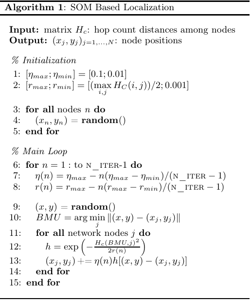

# 해야하는 일

1. 문제 정의
2. 알고리즘 정의 (Research Self-Organizing Maps; SOM)
    - SOM의 작동방식과 그 활용법 이해
    - 위치 추정 또는 대형 제어를 위해 SOM을 사용하는 것과 관련된 리소스, 튜토리얼, 예시를 탐색
3. 기본적인 SOM 구현하기
    - 원하는 프로그래밍 언어로 된 기존 라이브러리, 또는 코드 스니펫 사용
    - 특정 문제에 맞게 조정
4. 시뮬레이션 데이터로 테스트하기
    - 센서와 드론 사이의 거리가 알려진 데이터 세트를 만들거나 시뮬레이션
    - 이 데이터세트를 사용해 SOM 구현을 테스트하고 검증
    - 알고리즘이 드론 위치를 정확하게 복구할 수 있는지 확인
    (복구할 수 없는 경우, 왜 복구할 수 없는지 설명)
    - 해는 하나만 존재하지 않을 수 있으며, 여러 가지 유효한 formation이 존재할 수 있음을 고려
5. 내 접근을 문서화하기
    - 수행한 단계, 내린 결정, 직면한 모든 문제를 문서화
6. 진행상황 제출
    - 완벽한 해결책이 아니더라도 진행상황을 교수님께 제출

# 문제 정의

- No GPS, No interconnection information
- Drone들이 날고 있는 임의의 좌표가 존재할 때, 그 좌표와 원점 사이의 Euclidean 거리 정보만이 존재한다. 
- 현 상태에서, drone들이 어떻게 해야 "특정 형태의 대형(ex:삼각뿔)"을 만들고 유지할 수 있을까?

# 알고리즘 정의 (Research Self-Organizing Maps; SOM)

- Self Organizing Map(SOM)은 일종의 비지도 학습 알고리즘을 가진 신경망 모형으로, 입력 데이터의 특정 패턴이나 규칙을 찾아내는 데 사용됨
- SOM은 노드들이 육각형, 또는 직사각형의 형태와 같이 일정한 기하학적 격자 구조의 architecture을 지닌다는 특징이 있음
- 해당 노드들은 가중치 벡터를 가지고 있으며, 입력 데이터와의 유사도에 따라 위치가 조정되어 입력 데이터의 공간적 관계를 포착하고 데이터를 매핑함

## SOM의 작동방식

- Input sample 과 map의 weight $w_{j}$들이 d 차원의 실수값 벡터라고 가정하면, 학습 알고리즘은 다음과 같이 구성됨 

1. Sampling: 훈련 세트에서 샘플을 추출하여 사용함. 이후 현재 반복에서의 샘플을 x(n)이라고 하겠음
2. Competition: 추출된 샘플 x(n)은 맵의 가중치(이 때, 가중치 하나는 노드 하나에 대응)에 대해 판별함수를 통해 비교됨. 판별함수를 지난 값들 중 가장 큰 값을 지닌 노드가 Best Matching Unit, BMU가 되어 선택됨. 판별함수가 유클리드 거리를 통해 결정할 경우, 판별함수는 다음과 같음

$BMU(n)=\text{argmin}_{j} x(n) - w_j(n)$

- j = 노드의 인덱스, 2차원 격자일 경우 j = (i,k)
- $w_{j} =$ 현재 노드의 가중치 벡터
- $\text{argmin}_{j}$은 전체 노드 집합에 대해 해당 식의 값이 최소가 되는 인덱스, j를 탐색함
- $x(n) - w_j(n)$는 입력 샘플과 뉴런의 가중치 벡터 간의 차이를 나타냄
- 즉, 현재 반복에서의 샘플 데이터와 가장 가까운 노드를 찾는 방식임

3. Adaptation: 네트워크를 학습시키고 샘플에 적응하여 맵의 가중치를 조정함. BMU와 BMU와 이웃한 이웃 노드의 가중치 벡터는 다음 식에 따라 업데이트됨

$w_{j}(n+1) = w_{j}(n) + \eta(n) h(j,BMU(n))[x(n) - w_{j}(n)]$

새로운 가중치 = 현재 가중치 + (현재 입력 데이터 - 현재 가중치) * 전체학습률 $\eta(n)$ *이웃 함수 $h(j,BMU(n))$

전체 학습률 $\eta$와 이웃 함수 $h = h(i,j)$가 전체 식을 통제함 

식이 수렴하기 위해서는 각 iteration마다 $\eta$가 단조감소해야함 

일반적으로 $\eta$는 $[\eta(max),\eta(min)]=[0.1,0.01]$ 범위 내에서 감소하며, iteration는 훈련 세트의 크기에 따라 수백에서 수천까지 증가함

이웃함수 h는 노드들이 BMU unit에서 얼마만큼 떨어져 있는지에 따라 가중치를 관리함

정규분포 형태의 이웃 함수 h의 경우, 다음과 같이 구현함

$h(i,j) = exp(-\frac{dist_{map}(i,j)^2}{2r(n)})$

- $dist_{map}(i,j)^2$는 두 개의 노드 사이의 거리를 뜻함. BMU에 가까울수록 값이 커지고, 멀수록 값이 작아짐
- r(n)은 영향을 받는 범위를 뜻함. 전체학습률 $\eta$와 마찬가지로, 매 iteration마다 단조적으로 감소함

## Base SOM to Localization SOM(Wiresless Localization Using Self-organizing Maps)

<!--
- SOM은 훈련이 끝나면 각 노드가 입력공간을 대표하는 모델 벡터를 포함하게 됨. 이렇게 훈련된 SOM을 이용해 새로운 혹은 이전에 본 적 없는 입력 데이터를 분류하거나 특정 패턴을 인식하는 데 사용할 수 있음. 

- 즉 새로운 입력 데이터가 주어지면 주어진 샘플과 가장 일치하는 Best Matching Unit (BMU)의 가중치 벡터를 찾아 입력 데이터를 분류하거나 특성을 인식할 수 있음

- 뿐만 아니라, 각 BMU는 2차원 그리드에서 위치를 정의하므로 SOM은 입력 공간의 데이터를 노드 격자로 정의된 평면으로 나타낼 수 있음. 초기에 탐사 단계에서 센서에 의해 수집된 정보를 기반으로 훈련된 SOM은 가상의 지도로 활용되어 새로운 데이터를 격자 위치로 변환하거나 다양한 환경(예: 다른 방)을 인식하는 데 사용될 수 있음 -->

- SOM 기법의 핵심은 업데이트 수식임

$w_{j}(n+1) = w_{j}(n) + \eta(n) h(j,BMU(n))[x(n) - w_{j}(n)]$

- 이 표현식에서, 이웃 함수 h는 $dist_{map}(i,j)^2$ 를 통해 노드들의 공간적 배치를 계산함
- 즉 지도상에서 __두 노드가 얼마만큼 떨어져 있느냐에 대한 distance function이 제공된다면__, 일반적인 격자 대신 임의의 연결된 노드들로 구현할 수 있음

- 서로 연결된 노드(neuron)들의 네트워크를 꼭지점(Vertice)과 간선(Edge)을 통해서 그래프로 나타낼 수 있음. 이 때의 그래프를 $G_{net}$ 이라고 표현함. 이 두 노드들간의 최단거리 dist를 hop으로 정의함

- 이를 통해 classic SOM의 학습 알고리즘은 Localization에 사용될 수 있음
- 이웃함수를 아래의 식처럼 새롭게 정의함

$h(i,j) = exp(-\frac{dist_{map}(i,j)^2}{2r(n)}), \text{original}$
$h(i,j) = exp(-\frac{dist_{hop}(i,j)^2}{2r(n)}), \text{new}$

(노드(neuron)들은 $G_{net}$의 꼭지점 부분에 위치하므로, 노드 = 뉴런의 일대일 대응 관계가 성립함)

- 각 뉴런의 가중치는 $w_{j} = (x_{j},y_{j})$ 를 갖게 됨
- 임의의 위치에서 뽑힌 이 벡터들은 그 노드에 해당하는 추정 위치 정보를 가지게 됨

- 이렇게 수정된 SOM 알고리즘은 다음과 같은 과정을 통해 Localization을 실행함
    1. 노드들간의 거리 정보를 가진 입력변수 matrix $H_{C}$를 가져옴
        1. 각 노드와 각 노드의 근처 노드에 관한 정보를 가져옴. 이 정보는 인접행렬 $G_{net}$을 만들기 위해 필수적인 정보임.
        2. 이들을 계산해 노드들 간의 거리 hop을 가져오고, ${hc}_{i,j} = distmap(i,j)$로 주어진 $H_{C}$ 행렬에 저장함
        3. 이렇게 만들어진 행렬 $H_{C}$는 위치 결정 알고리즘에서 필요한 유일한 입력 매개변수가 됨
    2. 전체학습률의 범위를 정의
    3. 이웃노드를 결정하는 범위 r을 정의 
    4. 모든 노드 n에 대하여 가중치(위치 정보)를 초기화
    5. 학습을 시작하여 매 iteration마다 전체학습률과 이웃함수를 업데이트하며 x(n)과 가장 일치하는 노드 위치를 학습
        - $\eta(n) = \eta_{max} - n(\eta_{max}-\eta_{min})/(N_ITER - 1)$
        - $r(n) = r_{max} - n(r_{max}-r_{min})/(N_ITER - 1)$
        - h = $exp(-\frac{H_{c}(BMU,j)^2}{2r(n)})$, j = 1번의 iteration 내의 모든 노드 중 j 번째 노드
        - $(x_{j}, y_{j}) += \eta(n)h[(x,y)-(x_{j}, y_{j})]$
        

## 기본적인 SOM 구현

1. SOM의 알고리즘을 구현한 파이썬 라이브러리, MiniSOM 을 사용

## 나의 구현 방법

1. 순서를 바꿔, 가상의 relative information을 통해 먼저 일정 formation(ex: triangle)을 갖추도록 학습된 SOM을 준비함
2. 학습된 SOM 을 센서와 드론 사이의 euclidean information만으로 위치를 추정함

## 시뮬레이션 데이터로 테스트

- 실험 조건 정의(= 하이퍼파라미터 정보 정의)
- 