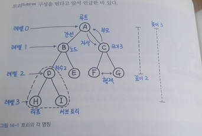
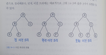

# 트리

## 트리의 각 명칭

## 트리의 속성

- 트리의 중요한 속성 중 하나는 트리가 재귀로 정의된 자기참조 자료구조라는 점이다. 

    - 쉽게 말하면 트리는 자식도 트리고, 또 그 자식도 트리다. 즉 여러 개의 트리가 쌓여 하나의 큰 트리가 된다.

    - 이를 흔히 서브트리(SubTree) 로 구성된다고 표현한다.

- 트리는 항상 루트에서 시작된다.

    - 루트는 자식 노드(Child)를 가지며, 간선(Edge) 으로 연결되어 있다. 

    - 자식 노드의 개수는 차수(Degree)이며 크기 (Size) 는 자신을 포함한 모든 자식 노드의 개수다.

    - 높이는 현재 위치에서부터 리프까지의 거리, 깊이는 루트에서부터 현재 노드까지의 거리이다. 

## 그래프 vs 트리

- 그래프와 트리의 차이점은 무엇일까? 

__"트리는 순환 구조를 갖지 않는 그래프이다!"__

- 핵심은 순환구조가 아니라는 데 있다. 

- 트리는 특수한 형태의 그래프의 일종이며, 크게 그래프의 범주에 연결된다.

- 하지만 트리는 그래프와 달리 한번 연결된 노드가 다시 연결되는 법이 없다. 

- 이외에도 단방향, 양방향 모두 가리킬 수 있는 그래프와 달리 트리는 부모 노드에서 자식노드를 가리키는 단방향 뿐이다.

## 이진 트리

- 트리 중에서도 가장 널리 사용되는 트리 자료 구조는 이진 트리와 이진 탐색 트리(BST: Binary Search Tree) 이다. 실제로 인터뷰에서도 가장 자주 질문을 받게 되는 기본적인 트리 형태이기도 하다.

- 먼저, 각 노드가 m 개 이하의 자식을 갖고 있으면 m - ary 트리(다항트리, 다진 트리) 라고 한다. 

- 여기서 m 이 2인 경우, 즉 모든 노드의 차수가 2 이하일 때는 특별히 이진 트리라고 부른다.

- 이진 트리는 왼쪽, 오른쪽 최대 2개의 자식을 갖는 매우 단순한 형태로 다진 트리에 비해 훨씬 간결할 뿐만 아니라 여러 가지 알고리즘을 구현하는 일도 좀 더 간단하게 처리할 수 있어 대체로 트리라고 하면 이진 트리를 일컫는다.

### 이진 트리 유형

- 정 이진 트리(Full Binary Tree): 모든 노드가 0개 또는 2개의 자식 노드를 갖는다.

- 완전 이진 트리(Complete Binary Tree): 마지막 레벨을 제외하고 모든 레벨이 완전히 채워져 있으며, 마지막 레벨의 모든 노드는 가장 왼쪽부터 채워져 있다.

- 포화 이진 트리(Perfect Binary Tree): 모든 노드가 2개의 자식 노드를 가지고 있으며 모든 리프노드가 동일한 깊이 또는 레벨을 갖는다. 문자 그대로 가장 완벽한 형태의 트리이다.

### 팁:

- DFS 는 스택, BFS 는 큐로 구현한다.